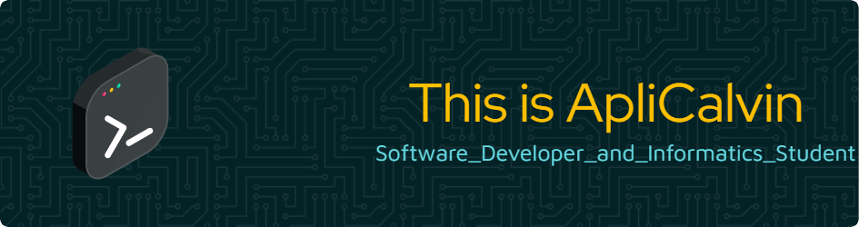

# Hello World 👋  

Welcome to my GitHub Profile!  
You’ll find a mix of **software engineering, fullstack development, and tech education.** Let’s build something awesome together! 🚀  

### 👨‍💻 About Me  

I am an **Informatics Engineering student** at **Dian Nuswantoro University**, deeply passionate about **programming, design, and education**. I love exploring the latest technologies and staying ahead of industry trends.  

🎤 **Educator & Mentor** — I enjoy sharing knowledge through **public speaking, mentoring, and tutoring**. Helping others understand programming and design is something I’m truly passionate about.  

🛠️ **Fullstack Developer** — Proficient in **web development**, I build scalable, high-performance applications using modern technologies.  

🚀 **Tech Enthusiast & Open Source Advocate** — I believe education is key to innovation and actively contribute to tech communities.  

🤝 **Open to Collaboration** — If you’re working on impactful projects and need a passionate developer & educator, let’s connect!  

### 📫 Get in Touch  
- 🔗 LinkedIn: [ApliCalvin LinkedIn Profile](https://linkedin.com/in/aplicalvin)  
- 🌍 Website/Portfolio: [My Website](https://aplicalvin.my.id)  
- ✉️ Email: [Email Me](mailto:calvins.simbolon@gmail.com)  

### 🛠️ Tech Stack & Tools  

  

### 📊 GitHub Stats  

  
  

> ⭐ **"Empowering Tech Through Education & Innovation!"**  
